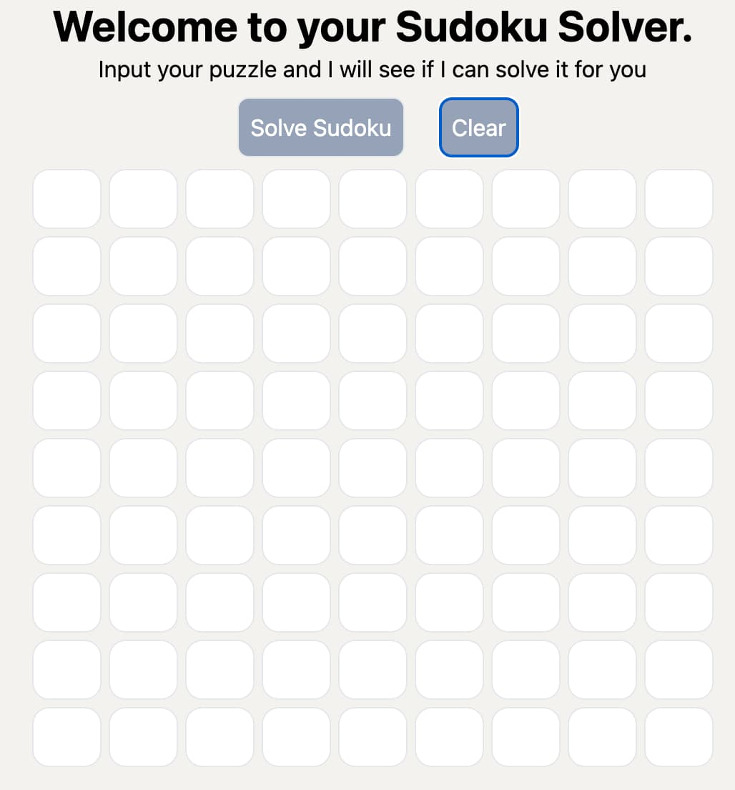

# Sudoku puzzle solver

This is a Sudoku puzzle solver

## Table of contents

- [Overview](#overview)

  - [Screenshot](#screenshot)
  - [Links](#links)

- [My process](#my-process)
  - [Built with](#built-with)
  - [What I learned](#what-i-learned)
  - [Continued development](#continued-development)
- [Author](#author)
- [Acknowledgments](#acknowledgments)

**Note: Delete this note and update the table of contents based on what sections you keep.**

## Overview

Users should be able to:

- Input a valid sudoku puzzle and see if it can be solved

### Screenshot

### Links

- Live Site URL: [Add live site URL here](https://your-live-site-url.com)

## My process

### Built with

- [Vite](https://vitejs.dev/) - frontend tool
- [React](https://reactjs.org/) - JS library

### What I learned

How to implement a backtracking solution

### Continued development

I will add additional features

## Author

ChartDesign

## Acknowledgments

Thanks ChatGPT
